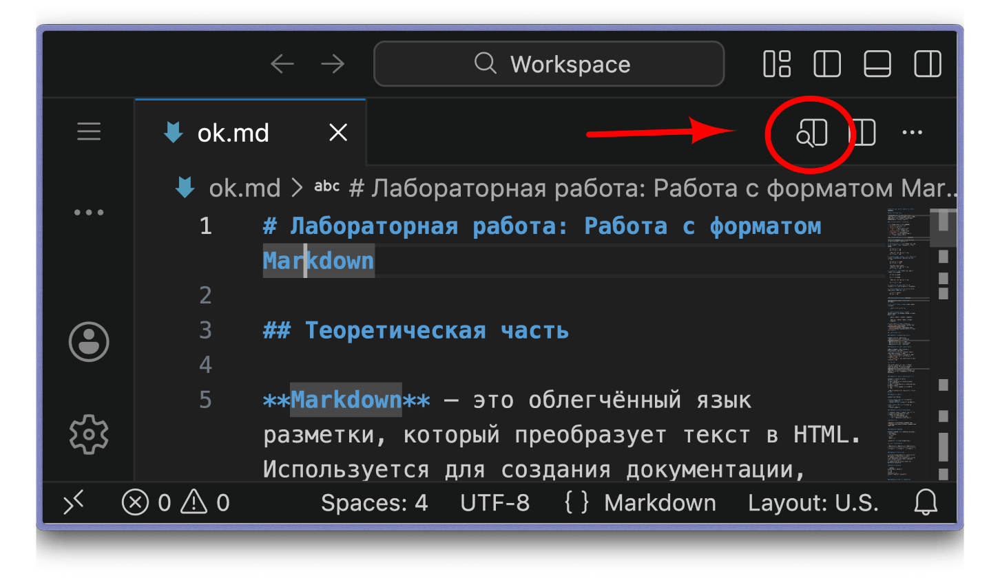

# Работа с Markdown в Visual Studio Code

VS Code — лёгкий, быстрый и расширяемый текстовый редактор поддерживающий все современные языки программирования (включая Markdown).
Кроме Desktop-ного приложения есть [веб-версия](https://vscode.dev), поддерживающая весь функционал программы.

Для начала работы необходимо создать новый файл. Для этого можно воспользоваться командой "Создать файл" (Ctrl + Alt + Win + N) или командой "Открыть файл" (Ctrl + O)

Теперь можно начать работать с текстом. Чтобы увидеть, как изменения влияют на основное отображение файла нужно открыть область предварительного просмотра сбоку:

Чтобы сохранить файл после работы нужно воспользоваться командой "Сохранить как" (Ctrl + Shift + S)
